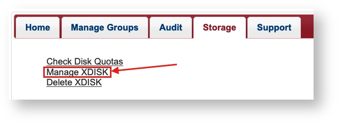
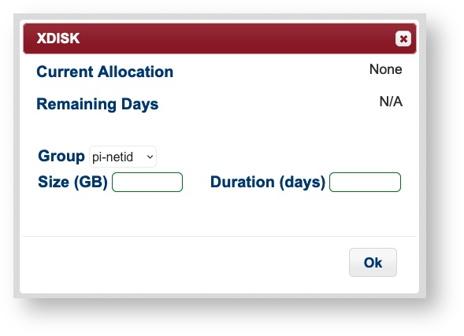
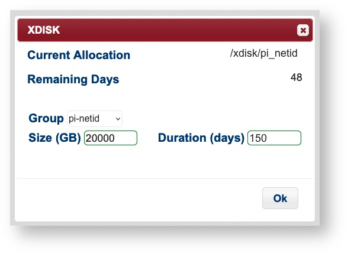
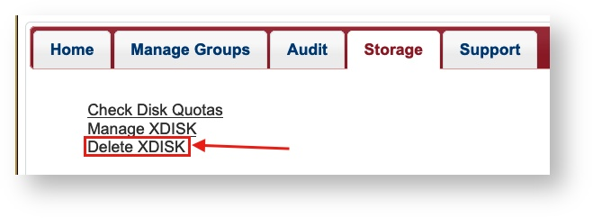
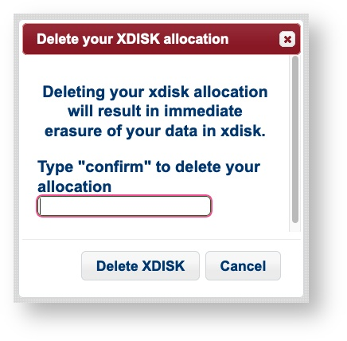

# HPC High Performance Storage

## Overview <a href="#hpchighperformancestorage-overview" id="hpchighperformancestorage-overview"></a>

The University’s Research Data Center provides data storage for active analysis on the high-performance computers (HPCs). Using central computing storage services and resources, University researchers, faculty researchers, and post-doctoral researchers are able to:

* Share research data in a collaborative environment with other UArizona affiliates on the HPC system
* Store large-scale computational research data
* Request additional storage for further data analysis

The storage is mounted as a filesystem and all the clusters have access to the same filesystems.

* _<mark style="color:red;">Data stored on HPC are not backed up! All data on this storage should be backed up elsewhere by UA researchers, preferably in three places and two formats.</mark>_
* _<mark style="color:red;">We strongly recommend that you do some regular housekeeping of your allocated space. Millions of files are hard to keep organized and even more difficult to migrate. Archiving or using a tool like tar will help keep our disk arrays efficient and potentially free up more space for you to use.</mark>_&#x20;

## HPC Storage Summary <a href="#hpchighperformancestorage-hpcstoragesummary" id="hpchighperformancestorage-hpcstoragesummary"></a>

Every user has access to individual and shared storage on the system where they can host data for active analyses. A summary of these locations is shown below:

| `/home/uxx/netid`  | An individual storage allocation provided for every HPC user                                                                                                                                                            | 50GB             | Accessible for the duration of user's account    |
| ------------------ | ----------------------------------------------------------------------------------------------------------------------------------------------------------------------------------------------------------------------- | ---------------- | ------------------------------------------------ |
| `/groups/pi_netid` | A communal storage allocation provided for every research group                                                                                                                                                         | 500GB            | Accessible for the duration of a PI's account    |
| `/xdisk/pi_netid`  | Temporary communal storage available for every group on request. See [xdisk section below](https://uarizona.atlassian.net/wiki/display/UAHPC/HPC+High+Performance+Storage#HPCHighPerformanceStorage-xdisk) for details. | 200GB-20TB       | Up to 300 days                                   |
| `/tmp`             | Local storage available on individual compute nodes.                                                                                                                                                                    | < 800GB to 1.4TB | Only accessible for the duration of a job's run. |

## Checking Storage Usage <a href="#hpchighperformancestorage-checkingstorageusage" id="hpchighperformancestorage-checkingstorageusage"></a>

### Command Line

To check your storage usage, use the command `uquota`. For example:

```bash
(puma) [netid@junonia ~]$ uquota
                                            used  soft limit  hard limit
/groups/pi_netid                            6.6G      500.0G      500.0G
/home                                      37.1G       50.0G       50.0G
/xdisk/pi_netid                            12.9G        9.8T        9.8T
```

### User Portal

You can check your storage allocation through our [online user portal](https://portal.hpc.arizona.edu/portal/) by navigating to the **Storage** tab and clicking **Check Disk Quotas**:

<figure><figcaption></figcaption></figure>

## XDISK

### What is xdisk? <a href="#hpchighperformancestorage-whatisxdisk" id="hpchighperformancestorage-whatisxdisk"></a>

xdisk is a temporary storage allocation available to all PIs and offers up to 20 TB of usable space for their group for up to 300 days. PIs may only have one active xdisk at a time.

A PI can request an allocation either via the command line or through our web portal (no paperwork necessary!). Only faculty members (PIs) may request, alter, or delete an allocation from the command line. Members of their research group may be [delegated management rights](https://uarizona.atlassian.net/wiki/display/UAHPC/Research+and+Class+Groups#ResearchandClassGroups-DelegatingGroupManagementRights) allowing them to manage a group's xdisk on their PI's behalf through [our web portal](https://portal.hpc.arizona.edu/portal/).

Once an xdisk allocation is created, it is immediately available for use. Groups can find their allocations under `/xdisk/pi_netid`. By default, a subdirectory is created for each group member under `/xdisk/pi_netid/netid`. If a group member is added after the allocation is created, a directory is not automatically created for them. To add one, [reach out to our consultants](https://uarizona.atlassian.net/wiki/spaces/UAHPC/pages/75990854/Getting+Help).\


Because xdisk allocations are temporary, they will expire as soon as their time limit is reached. Warnings will be sent to every group member at their netid@arizona.edu addresses beginning one week before the expiration. It is the group's responsibility to renew xdisk allocations or copy files to an alternate storage location prior to the expiration date. Once an xdisk allocation expires, everything in it is **permanently deleted**.

PIs may request a new xdisk allocation immediately after their previous one has expired. This ensures groups will always have access to increased storage on HPC on a rolling basis with the requirement that housekeeping be done once per academic year.


* <mark style="color:green;">Have a question about xdisk?</mark> [<mark style="color:blue;">**Check out our FAQs**</mark>](https://uarizona.atlassian.net/wiki/display/UAHPC/xdisk) <mark style="color:green;">to find answers to some common questions.</mark>
* <mark style="color:green;">Need a refresher on working with file permissions?</mark> [<mark style="color:blue;">**Check out our cheat sheet**</mark>](https://uarizona.atlassian.net/wiki/display/UAHPC/Cheat+Sheet#CheatSheet-LinuxFilePermissions)<mark style="color:blue;">**.**</mark>


### Requesting, Modifying, and Deleting an Allocation <a href="#hpchighperformancestorage-requesting-modifying-anddeletinganallocation" id="hpchighperformancestorage-requesting-modifying-anddeletinganallocation"></a>

<details>

<summary>Requesting an Allocation</summary>

_<mark style="color:orange;">If a group has an active xdisk allocation, a new one cannot be created until the active allocation expires or is deleted.</mark>_

PIs or delegates can request an xdisk allocation at any time through the user portal. Under the **Storage** tab, select **Manage XDISK**



This will open a web form where you can enter your size and duration requirements. The maximum size that can be requested is 20000GB and the maximum duration is 300 days. If a PI has created multiple research groups, you can specify the desired group ownership for the allocation from the Group dropdown menu. Once you click Ok, your allocation should immediately be available.



</details>

<details>

<summary>Modifying an Allocation</summary>

PIs or delegates may manage their xdisk allocation at any time through the user portal. Under the **Storage** tab, select **Manage XDISK**


This will open a form which will allow you to modify the size and duration of your xdisk. Xdisk allocations cannot be increased beyond 20000GB and the maximum duration of 300 days. Note: the Group field may only be modified at the time of the allocation's creation.



</details>

<details>

<summary>Deleting an Allocation</summary>

PIs or delegates may delete their xdisk allocation at any time through the user portal. Under the **Storage** tab, select **Delete XDISK**.



Clicking this link will open a window with a prompt. Type **confirm** and then select **Delete XDISK** to complete the process.



If you would like to request a new xdisk, you may do so as soon as the request is processed. Note: sometimes processing the request can take a few minutes, depending on the number of files and the size of the allocation.

</details>

***

### CLI Commands <a href="#hpchighperformancestorage-clicommands" id="hpchighperformancestorage-clicommands"></a>


<mark style="color:orange;">The xdisk CLI commands are usable by PIs only. Group delegates can manage allocations via the user portal.</mark>


xdisk is a locally written utility for PI's to create, delete, resize, and expire (renew) xdisk allocations.

| Function                   | Information                                                                                                                      | Command                                                                                                      | Examples                                                                                                                                                                                                                                                                                                       |
| -------------------------- | -------------------------------------------------------------------------------------------------------------------------------- | ------------------------------------------------------------------------------------------------------------ | -------------------------------------------------------------------------------------------------------------------------------------------------------------------------------------------------------------------------------------------------------------------------------------------------------------- |
| Display xdisk help         | Commands given in brackets are optional. If left blank, you will get system defaults.                                            | <pre><code>$ xdisk -c help
</code></pre>                                                                     | <pre class="language-bash"><code class="lang-bash">$ xdisk -c help
/usr/bin/xdisk -c [query|create|delete|expire|size] [-d days] [-m size]
</code></pre>                                                                                                                                                       |
| View current information   | Check current allocation size, location, and expiration date.                                                                    | <pre class="language-bash"><code class="lang-bash">$ xdisk -c query
</code></pre>                            | <pre class="language-bash"><code class="lang-bash">$ xdisk -c query
XDISK on host: ericidle.hpc.arizona.edu
Current xdisk allocation for &#x3C;netid>:
Disk location: /xdisk/&#x3C;netid>
Allocated size: 200GB
Creation date: 3/10/2020 Expiration date: 6/8/2020
Max days: 45 Max size: 1000GB
</code></pre> |
| Create an xdisk            | <p>Grants an xdisk allocation.<br>Max Size: 20000 GB<br>Max Days: 300</p>                                                        | <pre class="language-bash"><code class="lang-bash">$ xdisk -c create -m [size in gb] -d [days]
</code></pre> | <pre class="language-bash"><code class="lang-bash">$ xdisk -c create -m 300 -d 30
Your create request of 300 GB for 30 days was successful.
Your space is in /xdisk/&#x3C;netid>
</code></pre>                                                                                                                 |
| Extend the xdisk time      | Prior to its expiration, if your xdisk's time is under the 300 days, you may increase it until the 300 day limit is reached.     | <pre class="language-bash"><code class="lang-bash">$ xdisk -c expire -d [days]
</code></pre>                 | <pre class="language-bash"><code class="lang-bash">$ xdisk -c expire -d 15
Your extension of 15 days was successfully processed
</code></pre>                                                                                                                                                                  |
| Resize an xdisk allocation | <p>You may resize your allocation by specifying the increase/decrease in gb.<br>To reduce the size, use a negative sign, "-"</p> | <pre class="language-bash"><code class="lang-bash">$ xdisk -c size -m [size in gb]
</code></pre>             | <pre><code>$ # Assuming an initial xdisk allocation size of 200 gb
$ xdisk -c size -m 200
XDISK on host: ericidle.hpc.arizona.edu
Your resize to 400GB was successful
$ xdisk -c size -m -100
XDISK on host: ericidle.hpc.arizona.edu
Your resize to 300GB was successful
</code></pre>                        |
| Delete an xdisk allocation | Permanently deletes your current xdisk allocation. Be sure to remove any important data before deleting.                         | <pre class="language-bash"><code class="lang-bash">$ xdisk -c delete
</code></pre>                           | <pre class="language-bash"><code class="lang-bash">$ xdisk -c delete
Your delete request has been processed
</code></pre>                                                                                                                                                                                      |
