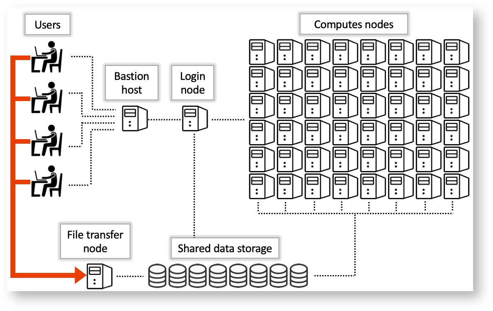
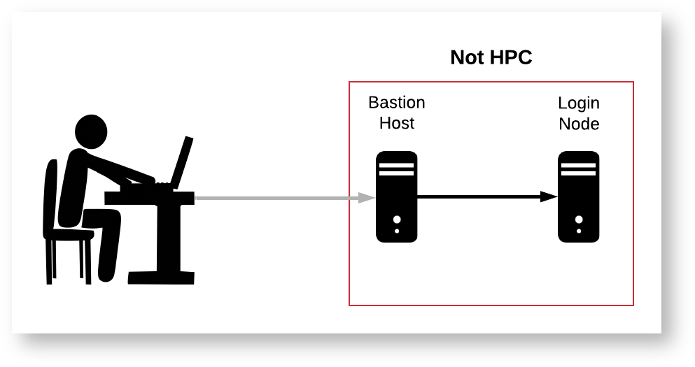
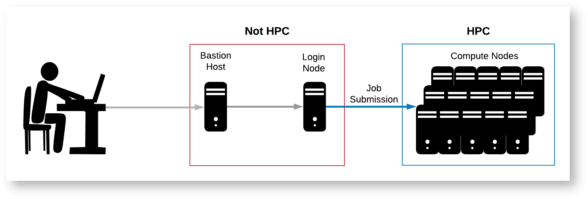

# HPC Quick Start

## Getting started <a href="#hpcquickstart-gettingstarted" id="hpcquickstart-gettingstarted"></a>

If you're just getting started with HPC, you may also want to check out a video recording of our [Intro to HPC workshop](https://confluence.arizona.edu/display/UAHPC/Training#Training-IntroductiontoHPC) in addition to this quick start.

This page is designed to give users an overview of how to run their work on our systems. By the end of this, you should know:

1. What HPC is
2. How to log in
3. What the bastion host, login nodes, and compute nodes are
4. What a job scheduler is&#x20;
5. How to access software
6. How to run interactive and batch jobs on HPC

If you have not already, you will need to [Register for an HPC Account](https://confluence.arizona.edu/display/UAHPC/Account+Creation) to follow along.

## What is HPC? <a href="#hpcquickstart-whatishpc" id="hpcquickstart-whatishpc"></a>

If you're looking to tackle complex problems or speed up your data analyses, HPC might be just what you need!

HPC is an acronym for High Performance Computing and is often used interchangeably with supercomputing. As a UArizona affiliate, you can be [sponsored by a faculty member](https://confluence.arizona.edu/display/UAHPC/Account+Creation#AccountCreation-SponsoredHPCAccountInstructionsSponsoredHPCAccountInstructions) ([faculty members can sponsor themselves](https://confluence.arizona.edu/display/UAHPC/Account+Creation#AccountCreation-PIAccountInstructionsPIAccountInstructions)) to receive free access to our three supercomputers Puma, Ocelote, and ElGato. These are clusters of computers that are housed in the lower level of the UITS building and are available for your analyses.

If you're interested in a more in-depth overview of what a supercomputer is, see our page [Supercomputing In Plain English](https://confluence.arizona.edu/display/UAHPC/Supercomputing+In+Plain+English).

## Logging in <a href="#hpcquickstart-loggingin" id="hpcquickstart-loggingin"></a>

### HPC Structure <a href="#hpcquickstart-hpcstructure" id="hpcquickstart-hpcstructure"></a>

Logging into the HPC is not quite the same as logging into your personal computer. Normally, when you log into your personal computer, you have access to all of your files and can run programs on all available CPUs right away. In contrast, the HPC is made up of a number of "nodes," each of which serves a different purpose. Below is a diagram and brief description of each node type.

<figure><figcaption></figcaption></figure>

* **Bastion Host:** This is the server you will encounter when first logging into HPC via SSH. You will not have access to any storage or files from here.
* **Login Node:** This node can be accessed from the bastion host, and has access to the main HPC filesystem. This node is essentially a single computer shared by all active users, so it is not ideal for running your code as it will impact other users. This node can be used for general organizational purposes and simple software configuration, but more complex installations or computations should be run from compute nodes. Running intensive code on the login nodes will slow down the system for other users and such processes will be shut down by administrators.&#x20;
* **Compute Nodes:** These are the powerful CPUs and GPUs that are intended to run intensive computations, and have access to the main HPC filesystem. Processors are allocated to specific jobs to avoid impacting other users' performance. There are multiple ways to access them, and multiple can be accessed simultaneously, which allows for access to large amounts of RAM and numbers of CPUs, enabling highly parallelized and memory intensive jobs.&#x20;
* **File Transfer Node:** This node connects the main HPC system to tertiary file systems such as rental storage. As its name suggests, its primary purpose is to move data around and is not intended for running computations.

### How to Connect <a href="#hpcquickstart-howtoconnect" id="hpcquickstart-howtoconnect"></a>

Users can connect to HPC remotely either through our browser-based graphical interface [Open On Demand](https://confluence.arizona.edu/display/UAHPC/Open+On+Demand), or through a local terminal. In this quick start, we'll use the terminal.

The steps for connecting depend on your operating system.

**Connecting with Mac/Linux**&#x20;

Use the Terminal (on a Mac, this can be found under Applications → Utilities → Terminal). On the command line, enter the following, replacing `netid` with your own NetID:

**Establishing a connection**

```
$ ssh netid@hpc.arizona.edu
```

You will then be prompted for your password. Note: when you enter it, you will not see characters appear. This is a security feature and completely normal.

After a successful login, you will be connected to **the bastion host**. This is a single computer that provides a gateway to our three clusters. This is the only function the bastion host serves. It is not for storing files, running programs, or accessing software. The hostname of this machine is **gatekeeper**.

**Accessing the bastion host**

```
Success. Logging you in...
Last login:
This is a bastion host used to access the rest of the RT/HPC environment. 

Type "shell" to access the job submission hosts for all environments
---------------------------------- 

[netid@gatekeeper 13:53:23 ~]$ hostname
gatekeeper.hpc.arizona.edu
[netid@gatekeeper 13:53:26 ~]$
```

To make logging into the HPC much faster,&#x20;

## **Node Summary** <a href="#hpcquickstart-nodesummary" id="hpcquickstart-nodesummary"></a>

Before submitting a Slurm script, you must know (or at least have a general idea) of the resources needed for your job. This will tell you which type of node to request, how much memory, and other useful information that can be provided to the system via your batch script. A detailed list of slurm batch flags are included below.&#x20;

### General Overview <a href="#hpcquickstart-generaloverview" id="hpcquickstart-generaloverview"></a>

| Node Type            | Description                                                                                                                                                                                                                                                                                                                                                            |
| -------------------- | ---------------------------------------------------------------------------------------------------------------------------------------------------------------------------------------------------------------------------------------------------------------------------------------------------------------------------------------------------------------------- |
| Standard CPU Node    | This is the general purpose node, which can (and should) be used by the majority of jobs.                                                                                                                                                                                                                                                                              |
| High Memory CPU Node | Similar to the standard nodes, but with significantly more RAM. There a only a few of them and they should only be requested if you have tested your job on a standard node and find that its memory usage is too high. Both standard and high memory nodes share the same file system, so there is no advantage in terms of long term storage, only active RAM usage. |
| GPU Node             | Similar to the standard node, but with one or more GPUs available, depending on which cluster is in use.                                                                                                                                                                                                                                                               |

### Hardware Limitations by Node Type and Cluster <a href="#hpcquickstart-hardwarelimitationsbynodetypeandcluster" id="hpcquickstart-hardwarelimitationsbynodetypeandcluster"></a>

Please consult the following table when crafting Slurm submission scripts. Requesting resources greater than what are available on a given cluster+node may lead to errors or delays.

| **Cluster** |   | **Node Type** | **N Nodes** | **N CPU/ Node** | **RAM/CPU** | **CPU RAM/ Node** | **N GPU/ Node** | **RAM/GPU** | **GPU RAM/ Node** | **Total N GPUs** |
| ----------- | - | ------------- | ----------- | --------------- | ----------- | ----------------- | --------------- | ----------- | ----------------- | ---------------- |
| Puma        |   | Standard      | 236         | 94              | 5 gb        | 470 gb            | -               | -           | -                 | -                |
| High Mem    |   | 3 standard    | 94          | 32 gb           | 3008 gb     | -                 | -               | -           | -                 |                  |
| 2 buy-in    |   |               |             |                 |             |                   |                 |             |                   |                  |
| GPU         |   | 8 standard    | 94          | 5 gb            | 470 gb      | 4                 | 32 gb           | 128 gb      | 32                |                  |
| 7 buy-in    |   | 28            |             |                 |             |                   |                 |             |                   |                  |
| Ocelote     |   | Standard      | 400         | 28              | 6 gb        | 168 gb            | -               | -           | -                 | -                |
| High Mem    |   | 1             | 48          | 41 gb           | 1968 gb     | -                 | -               | -           | -                 |                  |
| GPU         |   | 46            | 28          | 8 gb            | 224 gb      | 1                 | 16 gb           | 16 gb       | 46                |                  |
| El Gato     |   | Standard      | 130         | 16              | 4 gb        | 62 gb             | -               | -           | -                 | -                |

[See here for example Slurm requests.](https://confluence.arizona.edu/display/UAHPC/Running+Jobs+with+SLURM#RunningJobswithSLURM-examplerequestsNodeTypes/ExampleResourceRequests)

### Other Job Limits

In addition to fitting your jobs within the constraints of our hardware, there are other limitations imposed by the scheduler to maintain fair use.&#x20;

* Time Limit Per Job: A single job cannot run for more than 10 days (240 hours). Requesting more time than this will lead to your job being stuck in the queue indefinitely with reason code "QOSMaxWallDurationPerJobLimit" (see below for more reason codes).&#x20;
* CPU Hours Per Group: The number of CPU hours used per job is subtracted from the PI's allocation. [More info here](https://confluence.arizona.edu/display/UAHPC/Allocation+and+Limits#AllocationandLimits-CPUTimeAllocations).&#x20;

## Login Nodes

<figure><figcaption></figcaption></figure>

Once you connect to the bastion host, you'll notice it prompts you to type **`shell`**. Try typing it now. You should see:

```
[netid@gatekeeper 13:53:45 ~]$ shell
Last login: Fri Apr 28 15:30:08 2023 from gatekeeper.hpc.arizona.edu
***
The default cluster for job submission is Puma
***
Shortcut commands change the target cluster
-----------------------------------------
Puma:
$ puma
(puma) $
Ocelote:
$ ocelote
(ocelote) $
ElGato:
$ elgato
(elgato) $
-----------------------------------------
 
(puma) [netid@junonia ~]$
```

Note that the hostname has now changed. Where it used to say gatekeeper, it should now say either **wentletrap** or **junonia**. These are the **HPC login nodes**.

A login node is a small computer that serves as a staging area where you can perform housekeeping, edit scripts, and submit your work to run on the system. It's essential to know that [**the login nodes are not the location where your analyses are run**](https://confluence.arizona.edu/display/UAHPC/Best+Practices). Instead, the cluster's **compute nodes** are where the real work is done.

## Compute Nodes

<figure><figcaption></figcaption></figure>

### What are compute nodes? <a href="#hpcquickstart-whatarecomputenodes" id="hpcquickstart-whatarecomputenodes"></a>

In contrast to the login nodes, compute nodes are high-performance machines designed for computationally intensive applications that require a significant amount of processing power and memory. For example, a standard compute node on Puma has 94 CPUs available and 470GB of RAM!

### Different clusters, different compute nodes <a href="#hpcquickstart-differentclusters-differentcomputenodes" id="hpcquickstart-differentclusters-differentcomputenodes"></a>

Each of our supercomputers has its own cluster of compute nodes with [different resources available](https://confluence.arizona.edu/display/UAHPC/Running+Jobs+with+SLURM#RunningJobswithSLURM-examplerequestsNodeTypes/ExampleResourceRequests). When you first log into HPC, your environment is configured to submit jobs to our largest (and busiest cluster), Puma. You can see which cluster you're targeting by looking at the beginning of your command line prompt. To switch your target cluster, use one of the following shortcuts: **`elgato`**, **`ocelote`**, or **`puma`**.

For this tutorial, let's switch clusters by entering the shortcut **`elgato`**. This cluster is less busy than the others so you can get to development fast.


```
(puma) [netid@wentletrap ~]$ elgato
(elgato) [netid@wentletrap ~]$
```


### How do you actually access a compute node? <a href="#hpcquickstart-howdoyouactuallyaccessacomputenode" id="hpcquickstart-howdoyouactuallyaccessacomputenode"></a>

To connect to a compute node, you will need to use **the job scheduler**. A scheduler, in our case **SLURM**, is software that will find and reserve resources on a cluster's compute nodes as space becomes available. Resources include things like memory, CPUs, and GPUs that you want to reserve for personal use for a specified period of time. You can use the job scheduler to request two types of jobs: **interactive** and **batch**. We will cover both of these in the sections below\


### All there any limitations to what I can request? <a href="#hpcquickstart-allthereanylimitationstowhaticanrequest" id="hpcquickstart-allthereanylimitationstowhaticanrequest"></a>

Yes, there are some [limits to what you can request](https://confluence.arizona.edu/display/UAHPC/Allocation+and+Limits#AllocationandLimits-JobLimits). One of the important limits to understand is your group's [**CPU hours allocation**](https://confluence.arizona.edu/display/UAHPC/Allocation+and+Limits).

Allocations are a way of being "charged" to use HPC resources. Each group gets:

* 7,000 CPU hours on ElGato
* 70,000 CPU hours on Ocelote
* 100,000 CPU hours on Puma

These allocations are automatically refreshed on the first day of each month. Once your group's allocation runs out, you will need to wait until it is refreshed before using that allocation again.

Your group's account is charged for each request made to the scheduler, in other words for each job you submit. The amount charged is the number of CPUs requested multiplied by the number of hours reserved. For example, if you submit a job that requests 5 CPUs for 10 hours, your group will be charged 50 CPU hours. If your job ends early, you will be refunded any unused time.

To see your group's allocation, use the command **`va`** which stands for _view allocation_. For example:

```
(elgato) [netid@wentletrap ~]$ va
Windfall: Unlimited
 
PI: parent_974 Total time: 7000:00:00
    Total used*: 12:21:00
    Total encumbered: 20:46:00
    Total remaining: 6966:53:00
    Group: hpcteam Time used: 12:21:00 Time encumbered: 20:46:00
```

Make a note of your group's name for later.

## Interactive jobs <a href="#hpcquickstart-interactivejobs" id="hpcquickstart-interactivejobs"></a>

Let's start with a basic interactive job to get a feel for things.

### Starting a session <a href="#hpcquickstart-startingasession" id="hpcquickstart-startingasession"></a>

To connect to a compute node to work interactively, use the command **`interactive -a your_group`** replacing **`your_group`** with your own group's name that you found from running `va`. In my case, I'm going to use hpcteam.

**Requesting an interactive session:**

```
(elgato) [netid@wentletrap ~]$ interactive -a hpcteam
Run "interactive -h for help customizing interactive use"
Submitting with /usr/local/bin/salloc --job-name=interactive --mem-per-cpu=4GB --nodes=1    --ntasks=1 --time=01:00:00 --account=hpcteam --partition=standard
salloc: Pending job allocation 807340
salloc: job 807340 queued and waiting for resources
salloc: job 807340 has been allocated resources
salloc: Granted job allocation 807340
salloc: Nodes gpu66 are ready for job
[netid@gpu66 ~]$
```

By default, when you use the command `interactive`, you will be allocated one CPU for one hour. To request custom resources (more CPUs, more time, etc), the interactive command [can be modified](https://confluence.arizona.edu/display/UAHPC/Running+Jobs+with+SLURM#RunningJobswithSLURM-interactive-jobsInteractiveJobs).

That's it! You're now connected to a compute node (in my case, gpu66) and are ready to run some work.

### Let's check out some software <a href="#hpcquickstart-letscheckoutsomesoftware" id="hpcquickstart-letscheckoutsomesoftware"></a>

Software packages are not available on the login nodes but _are_ available on the compute nodes. Now that we're connected to one, we can see what's available. Software on HPC comes [installed as modules](https://confluence.arizona.edu/display/UAHPC/Accessing+Software). Modules make it easy to load and unload software from your environment. This allows hundreds of packages to be available on the same system without dependency or versioning conflicts. It's always good practice to specify which version of the software you need when loading to ensure a stable environment.

You can view and load software modules using the command **`module avail`** and **`module load`**, respectively. For example,

```
[netid@gpu66 ~]$ module avail python
 
------------------------------------------------- /opt/ohpc/pub/modulefiles --------------------------------------------------
   python/3.6/3.6.5    python/3.8/3.8.2 (D)    python/3.8/3.8.12    python/3.9/3.9.10
 
[netid@gpu66 ~]$ module load python/3.9
[netid@gpu66 ~]$ python3 --version
Python 3.9.10
```

Try running **`module avail`** without specifying any arguments. You'll notice we have _a lot_ available.

### Benefits of interactive sessions

Interactive sessions are excellent development environments. When connected to a compute node, some things you can do are:

* Run, test, and debug your code
* View, test, and use software
* Install your own software
* Run computationally-intensive commands that might impact others on the login nodes

### Drawbacks of interactive sessions <a href="#hpcquickstart-drawbacksofinteractivesessions" id="hpcquickstart-drawbacksofinteractivesessions"></a>

Interactive sessions are great testing and development environments, but may not be optimally suited for certain types of analyses. Some issues that may arise include:

* Your session may time out due to inactivity
* Your internet connection may get disrupted
* Your computer may get closed or turned off
* You want to run more than one job at a time

What's a good solution to deal with these challenges? The answer: **batch jobs**!

## Batch jobs

### The basics <a href="#hpcquickstart-thebasics" id="hpcquickstart-thebasics"></a>

Batch jobs are a way of submitting work to run on HPC without the need to be present. This means you can log out of the system, turn off your computer and walk away without your work being interrupted. It also means you can submit multiple (up to 1000) jobs to run simultaneously!

Running these sorts of jobs requires two steps:

#### **First Step:** Create a text file with three sections:

1. &#x20;The header. This is called a shebang and goes in every batch script. It tells the system which interpreter to use (i.e., which language to execute the instructions in): \
   \
   **Part 1: The shebang**\
   `#!/bin/bash`
2. Instructions that tell the job scheduler the resources you need and any other job specifications. This section will look like:\
   \
   **Part 2: The SBATCH directives** \
   `#SBATCH --option1=value1` \
   `#1SBATCH --option2=value2 . . .`
3. A blueprint of how to run your work. This includes all the commands you would need to run in the terminal. This section might look like:\
   \
   **Part 3: The blueprint** \
   `cd /path/to/directory` \
   `module load python/3.9` \
   `python3 some_script.py`

#### **Second Step:** Submit the text file to the scheduler with the command **sbatch**.

Let's try creating our first job now using the outline provided above.

### Creating the sample code <a href="#hpcquickstart-creatingthesamplecode" id="hpcquickstart-creatingthesamplecode"></a>

Let's start by creating a simple Python script that we'll run in batch.

Create a directory and a blank file:

```
[netid@gpu66 ~]$ mkdir ~/hello_world && cd ~/hello_world
[netid@gpu66 hello_world]$ touch hello_world.py
```

Now open the file in your favorite text editor (for example, [nano](https://www.nano-editor.org/docs.php) or [vim](https://vimdoc.sourceforge.net/)) and add:


```
import os 

hostname = os.uname()[1]
print("Hello world! I'm running on hostname %s"%hostname)
```


Then save and exit. If we run this interactively, we'll see

```
[netid@gpu66 hello_world]$ python3 hello_world.py
Hello world! I'm running on hostname gpu66.elgato.hpc.arizona.edu
```

### Creating the batch script <a href="#hpcquickstart-creatingthebatchscript" id="hpcquickstart-creatingthebatchscript"></a>

Now, let's make a new file called hello\_world.slurm

```
[netid@gpu66 hello_world]$ touch hello_world.slurm
```

Now open it in your favorite text editor.

#### Step 1: Add the shebang and SBATCH directives <a href="#hpcquickstart-step1-addtheshebangandsbatchdirectives" id="hpcquickstart-step1-addtheshebangandsbatchdirectives"></a>

In this example, we're using the standard partition. A partition is a job queue and affects a job's priority and how hours are charged. More information on partitions/job queues can be found under [Allocation and Limits](https://confluence.arizona.edu/display/UAHPC/Allocation+and+Limits) and in our [SLURM documentation](https://confluence.arizona.edu/display/UAHPC/Running+Jobs+with+SLURM#RunningJobswithSLURM-JobPartitionRequestsJobPartitionRequests). For now, let's stick to standard.

A comprehensive list of all the options you can specify in your batch script can be found on our [Running Jobs with SLURM](https://confluence.arizona.edu/display/UAHPC/Running+Jobs+with+SLURM#RunningJobswithSLURM-batch-directivesBatchJobDirectives) page. In this example, we'll stick with some of the basics:

```
#!/bin/bash
 
# --------------------------------------------------------------
### PART 1: Requests resources to run your job.
# --------------------------------------------------------------
### Optional. Set the job name
#SBATCH --job-name=hello_world
### Optional. Set the output filename.
### SLURM reads %x as the job name and %j as the job ID
#SBATCH --output=%x-%j.out
### REQUIRED. Specify the PI group for this job. Replace <PI GROUP> with your own group.
#SBATCH --account=<PI GROUP>
### REQUIRED. Set the partition for your job. This is a job queue
#SBATCH --partition=standard
### REQUIRED. Set the number of nodes
#SBATCH --nodes=1
### REQUIRED. Set the number of CPUs that will be used for this job. 
#SBATCH --ntasks=1
### REQUIRED. Set the memory required for this job.
#SBATCH --mem-per-cpu=5gb
### REQUIRED. Specify the time required for this job, hhh:mm:ss
#SBATCH --time=00:01:00
```

#### Step 2: Add your code instructions <a href="#hpcquickstart-step2-addyourcodeinstructions" id="hpcquickstart-step2-addyourcodeinstructions"></a>

After the SBATCH directives, we'll add the instructions for executing our code to the same file

```
# --------------------------------------------------------------
### PART 2: Executes bash commands to run your job
# --------------------------------------------------------------
### Load required modules/libraries if needed
module load python/3.9
 
### change to your script’s directory
cd ~/hello_world
 
### Run your work
python3 hello_world.py
sleep 10
```

Now save and exit.

### Submitting the job

In this tutorial, we are submitting our job from an interactive session on a compute node. You may also submit jobs from a login node.&#x20;

The next step is to submit your job request to the scheduler. To do this, you’ll use the command **sbatch**. This will place your job in line for execution and will return a job ID. This job ID can be used to check your job’s status with **squeue**, cancel your job with **scancel**, and get your job’s history with **job-history**. A more comprehensive look at job commands can be found in our documentation on [monitoring your jobs](https://confluence.arizona.edu/display/UAHPC/Running+Jobs+with+SLURM#RunningJobswithSLURM-SLURMandSystemCommands).&#x20;

Let’s run our script and check its status (substitute your own job ID below where relevant):

```
[netid@gpu66 hello_world]$ sbatch hello_world.slurm
Submitted batch job 807387
[netid@gpu66 hello_world]$ squeue --job 807387
             JOBID PARTITION     NAME     USER ST       TIME  NODES NODELIST(REASON)
            807387  standard hello_wo    netid PD       0:06      1 gpu66
```

You can see its state is PD (for pending) which means it’s waiting to be executed by the system. Its state will go to R when it’s running and when the job has completed running, squeue will return a blank line.

Let’s check the contents of our file with cat. If your run was successful, you should see:

```
[netid@gpu66 hello_world]$ cat hello_world-807387.out
Hello world! I'm running on hostname gpu67.elgato.hpc.arizona.edu
[netid@gpu66 hello_world]$
```

Note that the hostname in this run is different from the hostname of the computer we're connected to. This is because it's a separate job from our interactive session and so may run on any other applicable machines on the cluster.

## Additional resources <a href="#hpcquickstart-additionalresources" id="hpcquickstart-additionalresources"></a>

That's it! You've now successfully run both a batch and interactive job on HPC. To continue learning about HPC, our online documentation has a lot more information that can help get you started. For example [FAQs](https://confluence.arizona.edu/display/UAHPC/FAQ), [additional SBATCH directives](https://confluence.arizona.edu/display/UAHPC/Running+Jobs+with+SLURM#RunningJobswithSLURM-batch-directivesBatchJobDirectives), information on [HPC storage,](https://confluence.arizona.edu/display/UAHPC/Storage#Storage-HPCHighPerformanceStorage\(Tier1\)) and [file transfers](https://confluence.arizona.edu/display/UAHPC/Transferring+Data).

Other great resources include: [virtual office hours every Wednesday](https://confluence.arizona.edu/display/UAHPC/Getting+Help#GettingHelp-OfficeHours) from 2:00-4:00pm, [consultation services offered through ServiceNow](https://confluence.arizona.edu/display/UAHPC/Getting+Help#GettingHelp-ConsultingServices), an [examples Github page with sample jobs](https://ua-researchcomputing-hpc.github.io/), and [a YouTube channel](https://www.youtube.com/@universityofarizonauitsres7597) with training videos.
