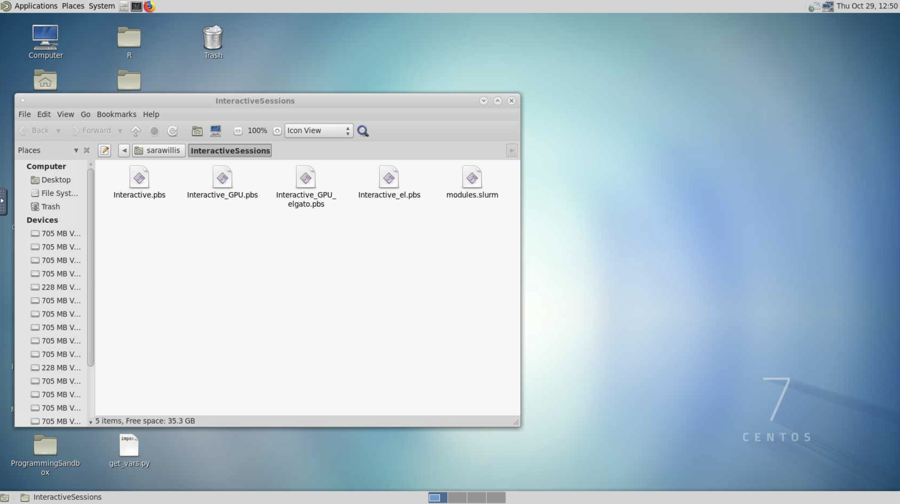
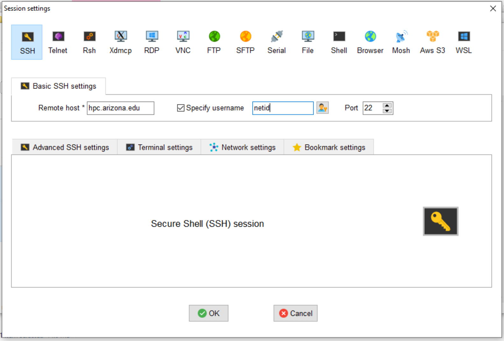

# System Access

## Overview <a href="#systemaccess-overview" id="systemaccess-overview"></a>

Logging into the HPC supercomputers starts with your UArizona NetID and password with two-factor authentication enabled. Logging in will first connect you to something called the **bastion host**, a computer that provides a gateway to our three clusters: Ocelote, ElGato, and Puma. This is the **only** function the bastion host serves. It is not for storing files, running programs, or accessing software.&#x20;

A comprehensive walkthrough of this process is in our [Puma Quick Start page](https://uarizona.atlassian.net/wiki/spaces/UAHPC/pages/75989999/HPC+Quick+Start). This page is intended to provide you with instructions on getting terminal access to the system from your specific OS, how to log into the system from our web interface ([Open OnDemand](https://ood.hpc.arizona.edu/)), how to set up X11 (image) forwarding, and how to configure your account to allow for a password-less login (see: [System Access#SSH Keys](https://uarizona.atlassian.net/wiki/pages/resumedraft.action?draftId=75990560#SystemAccess-SSHKeys)).

If you experience any problems, refer to our [FAQ page](https://uarizona.atlassian.net/wiki/spaces/UAHPC/pages/75993121/FAQ) which provides some solutions to common problems.

## Web Access <a href="#systemaccess-webaccess" id="systemaccess-webaccess"></a>

The web interface, [Open OnDemand](https://ood.hpc.arizona.edu/), provides access to HPC's three clusters. More comprehensive information on this service can be found on our [Open On Demand](https://uarizona.atlassian.net/wiki/spaces/UAHPC/pages/75990636/Open+On+Demand) page.





Users can gain command line access to HPC through our OOD web interface as an alternative to using a local SSH Client. To use this interface:

1. Log into [https://ood.hpc.arizona.edu/](https://ood.hpc.arizona.edu/)
2. Go to the dropdown menu at the top of the screen and select **Clusters**
3. Click **Shell**
4. This will put you on the command line on one of the login nodes where you may perform regular housekeeping work, submit jobs, or request an interactive session.. By default, you will automatically be connected to Puma. To navigate to a different cluster, use the displayed shortcuts.&#x20;






Users may also interact with a cluster using a virtual desktop interface. To do this:

1. Log into [https://ood.hpc.arizona.edu/](https://ood.hpc.arizona.edu/) and, under **My Interactive Sessions**, select **Interactive Desktop** under **Desktops** on the left-hand side of the page.
2. A form will appear where you will select the target **cluster**, enter the amount of **time** you'd like to be allotted (in hours), the number of **cores** you need, your **PI Group** (if you are unsure what your group name is, you can check in [https://portal.hpc.arizona.edu/portal/](https://portal.hpc.arizona.edu/portal/)), and the **queue**. Once you've filled in your request, click **Launch**.


3. A window will appear with the status of your request. It will start in a Pending state and will switch to Running when your desktop session is ready. Click **Launch Interactive Desktop** to access your session.


4. That's it! You can now use the cluster with a Desktop interface







## Command Line/Terminal Access <a href="#systemaccess-commandline-terminalaccess" id="systemaccess-commandline-terminalaccess"></a>

* <mark style="color:green;">All the integration on UArizona HPC supercomputers is done with the  "bash” shell which means to get consistent results,</mark> <mark style="color:green;"></mark>_<mark style="color:green;">bash</mark>_ <mark style="color:green;"></mark><mark style="color:green;">must be your shell.  New HPC users automatically are set to the bash shell unless they already are using a different shell.</mark>
* <mark style="color:green;">When using SSH, if you leave out the</mark> <mark style="color:green;"></mark>_<mark style="color:green;">netid@</mark>_ <mark style="color:green;"></mark><mark style="color:green;">then it may default to your workstation username, which may not be valid; on Linux and MacOS you can override this via a \~/.ssh/config "User netid" config line. On Windows, there may be an application-specific way to set the username for</mark> [<mark style="color:green;">hpc.arizona.edu</mark>](http://hpc.arizona.edu/) <mark style="color:green;">connections.</mark>
* <mark style="color:green;">If you try to log in and get a continuous prompt of "password" and nothing else, you are probably not registered for</mark> [<mark style="color:green;">NetID+</mark>](https://netid.arizona.edu/)<mark style="color:green;">.</mark>&#x20;

To log into HPC, you will need [NetID+](https://it.arizona.edu/service/netid-plus) enabled, an [HPC account](https://uarizona.atlassian.net/wiki/spaces/UAHPC/pages/75990889/Account+Creation), and internet access. Because we require Duo-authentication to access the system, no VPN is required.&#x20;

Logging in will first connect you to something called the **bastion host**, a computer that provides a gateway to our three clusters: Ocelote, ElGato, and Puma. This is the **only** function the bastion host serves. It is not for storing files, running programs, or accessing software.

<details>

<summary>Mac Access</summary>

Mac systems provide a built-in SSH client, so there is no need to install any additional software. You will find the terminal application under **Applications → Utilities → Terminal**.


Open the terminal and enter:

```bash
$ ssh netid@hpc.arizona.edu
```

where `netid` is your UArizona NetID. When you press enter, you will be prompted for your university password. Note: you will not see any characters appear on the screen while typing during this step. This is normal and everything is working as it should. After successfully entering your password, you will be prompted to Duo Authenticate. If everything is successful, you will be connected to the bastion host.

</details>

<details>

<summary>Windows Access</summary>

Windows systems do not have any built-in support for using SSH, so you will have to download a software package to do so. There are several available for Windows workstations.  Free SSH clients are available for download from the University of Arizona's [**Site License**](https://uarizona.service-now.com/sp?id=sc\_cat\_item\&sys\_id=26fe95e12f309150a55e95acf699b686\&sysparm\_category=4bced1e12f309150a55e95acf699b6ad) website. &#x20;

#### PuTTY <a href="#systemaccess-putty" id="systemaccess-putty"></a>

PuTTY is the most popular open source SSH Windows client. To use it: download, install, and open the [Putty client](https://www.putty.org/). Next, open a connection and enter **`hpc.arizona.edu`** under Host Name and press Open


This will open a terminal. At the prompt, enter the following, replacing `<netid>` with your own NetID:

```
Login as: <netid>
```

You will then be prompted to Duo-Authenticate. If the process is successful, you will be connected to the bastion host.

MobaXterm

MobaXterm is another available SSH Windows client. To connect to HPC, [download and install MobaXterm](https://mobaxterm.mobatek.net/download.html), open the software, select **Session → SSH** and enter **`hpc.arizona.edu`** under **Remote host**. Next, select the box next to **Specify username** and enter your UArizona NetID. To connect, click OK at the bottom of the screen:




This will open a terminal and will prompt you for your UArizona password. You will then need to Duo-authenticate. If everything is successful, you will be connected to the bastion host.

</details>

<details>

<summary>Linux Access</summary>

Linux systems provide a built-in SSH client, so there is no need to install additional software. Simply locate and run the Terminal app.

Open the terminal and enter:

```bash
$ ssh netid@hpc.arizona.edu 
```

where netid is your UArizona NetID. When you press enter, you will be prompted for your university password. Note: you will not see any characters appear on the screen while typing during this step. This is normal and everything is working as it should. After successfully entering your password, you will be prompted to Duo Authenticate. If everything is successful, you will be connected to the bastion host.

Once you reach the bastion host, regardless of method, you should see the following:

```bash
Success. Logging you in...
Last login:
This is a bastion host used to access the rest of the RT/HPC environment.
   
Type "shell" to access the job submission hosts for all environments
-----------------------------------------
```

From there, type `shell` to connect to the login nodes that will provide access to our three clusters. On the login nodes, you should see:

```bash
***
The default cluster for job submission is Puma
***
Shortcut commands change the target cluster
-----------------------------------------
Puma:
$ puma
(puma) $
Ocelote:
$ ocelote
(ocelote) $
ElGato:
$ elgato
(elgato) $
-----------------------------------------
```

By default, you will be connected to Puma when you first log in. To access the other clusters, follow the shortcut commands.&#x20;

</details>

***

## X11 Forwarding

X11 forwarding is a mechanism that allows a user to start up a remote application (e.g. VisIt or Matlab) and forward the application display to their local machine. The key to make forwarding work successfully is to include the `-X` flag at each login step. To check whether X11 forwarding is active, you may run the command:

```bash
$ echo $DISPLAY
```

If it comes back blank, something has gone wrong.

<details>

<summary>X11 Forwarding on Mac and Linux</summary>

* <mark style="color:green;">On a Mac, if you get a blank response to "echo $DISPLAY, you might need this line in your .ssh/config file:</mark> <mark style="color:green;"></mark><mark style="color:green;">`ForwardX11Trusted yes`</mark>
* <mark style="color:green;">Mac users will want to install the additional software package</mark> [<mark style="color:green;">XQuartz</mark>](https://www.xquartz.org/) <mark style="color:green;">onto their machines to use X11 forwarding with HPC.</mark>&#x20;
* <mark style="color:green;">Be aware forwarding X traffic does not work with the DEPRECATED menu interface enabled.  You should disable the menu option and use the hostname shortcuts instead.</mark>

Start a terminal session and connect as you typically would with an additional flag `-X` in your `ssh` command (shown in the example below). Once you're connected to the bastion host, enter the name of the cluster you want to access, including the additional `-X` flag again. An example of this process is provided below:

```bash
$ ssh -X netid@hpc.arizona.edu
Password:
Duo two-factor login for netid
Enter a passcode or select one of the following options:
 
 1. Duo Push to XXX-XXX-8969
 2. Phone call to XXX-XXX-8969
 3. Phone call to XXX-XXX-0502
 4. SMS passcodes to XXX-XXX-8969
 
Passcode or option (1-4): 1
Success. Logging you in...
Last login:
This is a bastion host used to access the rest of the RT/HPC environment.
  
Type "shell" to access the job submission hosts for all environments
-----------------------------------------            
[netid@gatekeeper ~]$ echo $DISPLAY
localhost:13.0
 
[netid@gatekeeper ~]$ shell -X
***
The default cluster for job submission is Puma
***
Shortcut commands change the target cluster
-----------------------------------------
Ocelote:
$ ocelote
(ocelote) $
Puma:
$ puma
(puma) $
 
(puma)[netid@junonia ~]$ echo $DISPLAY
localhost:18.0
```

</details>

<details>

<summary>X11 Forwarding on Windows</summary>

To use X11 forwarding on a Windows system, you will need to download an X11 display server such as Xming.&#x20;

#### PuTTY <a href="#systemaccess-putty.1" id="systemaccess-putty.1"></a>

To enable X11 forwarding in PuTTY, go to **SSH → X11** and select the box next to **Enable X11 forwarding**.


Once you've connected to the bastion host, connect to the login nodes with the an additional flag `-X`:

```bash
$ shell -X
```

#### MobaXterm <a href="#systemaccess-mobaxterm.1" id="systemaccess-mobaxterm.1"></a>

To enable X11 forwarding in MobaXterm, open a new session, select **SSH**, and open **Advanced SSH settings**. Select the option below called **X11-Forwarding.**


Once you've connected to the bastion host, connect to the login nodes with the an additional flag `-X`:

```bash
$ shell -X
```

</details>

## SSH Keys <a href="#systemaccess-sshkeys" id="systemaccess-sshkeys"></a>

#### **Why Use SSH Keys?** <a href="#systemaccess-whyusesshkeys" id="systemaccess-whyusesshkeys"></a>

The Bastion Host uses two-factor authentication and will, by default, prompt you for a password and 2nd factor when you attempt to log in. As an alternative, you can use PKI (Public Key Authentication). This means you will not have to provide a password or Duo-authenticate for any future sessions. To do this, you will need to create an SSH Key on your local workstation and copy the public key to the \~/.ssh/authorized\_keys file in your HPC account on the bastion host.

<details>

<summary>Mac and Linux</summary>

In a Terminal session on your local workstation:

1.  Create a public-key pair:&#x20;

    ```bash
    $ ssh-keygen -t rsa
    ```

    You will be prompted to enter a passphrase. This is optional, but we **strongly** recommend that you do so.
2. After running that command, you will have two new files on your local computer: `~/.ssh/id_rsa` and `~/.ssh/id_rsa.pub`
   * `id_rsa` is your private key file. **Do not share this with anybody**! It is analagous to your password; anybody who has this file can impersonate you.
   * `id_rsa.pub` is your public key file. You will upload this onto any servers that you wish to automatically login to.
3.  Copy the public key to the Bastion Host (you will need to enter your password this one time):

    <pre class="language-bash"><code class="lang-bash"><strong>$ ssh-copy-id netid@hpc.arizona.edu
    </strong></code></pre>
4.  If your computer does not support the ssh-copy-id command, run the following commands:\


    ```bash
    $ scp ~/.ssh/id_rsa.pub netid@hpc.arizona.edu:
    $ ssh netid@hpc.arizona.edu # (you will need to use your password this time)
    $ mkdir -p ~/.ssh && cat ~/id_rsa.pub >> .ssh/authorized_keys && rm ~/id_rsa.pub # On the server, copies the key into the appropriate file
    ```

    Now, logout and attempt to login to the server again. You should not be prompted for a password!

</details>

<details>

<summary>Windows</summary>

To setup SSH keys on Windows with the PuTTy client, refer to the [official PuTTy documentation](http://the.earth.li/\~sgtatham/putty/0.63/htmldoc/Chapter8.html#pubkey).

</details>

#### Using SSH Keys for file transfers <a href="#systemaccess-usingsshkeysforfiletransfers" id="systemaccess-usingsshkeysforfiletransfers"></a>

Note that SSH Keys can also be used to avoid entering a password and 2nd factor when transferring files to to the cluster via the file transfer node (**filexfer.hpc.arizona.edu**) using command line programs like scp or sftp.  Follow the steps above (2-4 under the Mac and Linux instructions), except use **filexfer.hpc.arizona.edu** instead of **hpc.arizona.edu**.  Note that you only need to generate the keys in Step 1 once.  The same `~/.ssh/id_rsa.pub` file may be used to identify yourself to multiple hosts.
